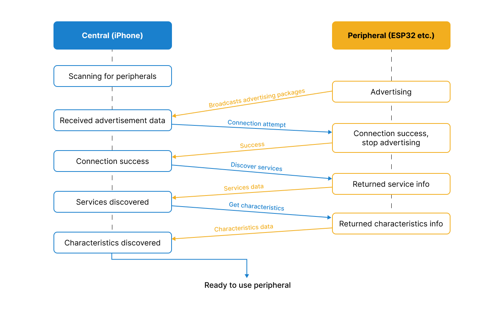

# ESP32 BLE Remote Control Demo


This sketch demonstrates how to use ESP32 for BLE-based remote control functionalities, including controlling on-board LED, a traffic light leds, and a seven-segment display.

The ESP32 is controlled via an iOS application developed here - https://github.com/ArtsemiR/Swift-ESP32-BLE-Remote-Control-Demo

## Overview
A project with setting up Central using an iPhone as an example can be found in this project on Swift+Xcode - https://github.com/ArtsemiR/ESP32-BLE-Remote-Control-Demo

The scheme represents a simplified flow of how a central device, such as an iPhone, interacts with a peripheral device through Bluetooth Low Energy (BLE):
1. The iPhone starts looking for BLE devices nearby.
2. The peripheral is broadcasting a signal to announce its presence to devices like the iPhone.
3. The iPhone picks up this signal, learning that the peripheral is available to connect.
4. The iPhone successfully connects to the peripheral, which then stops broadcasting since it's no longer just advertising but is now connected.
5. The iPhone asks the peripheral to list its services.
6. The peripheral sends back information about the services it offers.
7. The iPhone requests the details of these services, referred to as "characteristics"
8. The peripheral provides this detailed characteristics information.
9. With all the necessary information exchanged, the iPhone is now ready to interact with the ESP32 for its intended use.

## Configuration

### main.cpp
### Includes and Defines

```cpp
#include <Arduino.h>
#include <BLEDevice.h>
#include <BLEUtils.h>
#include <BLEServer.h>

// UUIDs for the BLE service and characteristic
#define SERVICE_UUID        "4fafc201-1fb5-459e-8fcc-c5c9c331914b"
#define CHARACTERISTIC_UUID "beb5483e-36e1-4688-b7f5-ea07361b26a8"
```
This section sets up the necessary BLE libraries and defines UUIDs for the BLE service and characteristic for communication.

### GPIO Pin Configuration
```cpp
// GPIO pin for the LED
const int ledPin = 2; 

// GPIO pins for Traffic Light LEDs
const int redPin = 15; 
const int yellowPin = 4;
const int greenPin = 16;

// GPIO pins for Seven-segment Display
const int segmentA = 17; 
const int segmentB = 5;
...
const int segmentDP = 22;

// BOOT button pin
const int buttonPin = 0; // BOOT button on ESP32 connected to GPIO0
```
This part defines the GPIO pins for various components, such as the onboard LED, traffic light LEDs, and seven-segment display segments.

### Global Variables and Functions
```cpp
BLECharacteristic *pCharacteristic;
bool buttonState = false;

void setLedColor(const std::string& value) {
    // Function to control the LED color.
}

void set7SegmentDisplayNumber(int num) {
    // Function to control the seven-segment display.
}

void resetValues() {
    // Function to reset all outputs to their default states.
}
```
Global variables for BLE characteristic and button state are declared. Functions for controlling the module states.

### BLE Server and Characteristic Callbacks
```cpp
class MyServerCallbacks: public BLEServerCallbacks {
    // Handles BLE connect and disconnect events.
};

class ESP32Callbacks: public BLECharacteristicCallbacks {
    // Handles data written to the BLE characteristic.
};
```
Custom classes for handling BLE events, including device connections, disconnections, and data reception through the BLE characteristic.

### Setup and Loop Functions
```cpp
void setup() {
    // Initializes serial communication, configures GPIO pins, sets up BLE.
}

void loop() {
    // Main loop, checks button state and sends updates via BLE.
}
```
The setup function initializes the system, setting up serial communication, GPIO pins, and BLE services. The loop function contains the main logic that runs continuously, checking the button state and sending BLE updates.
